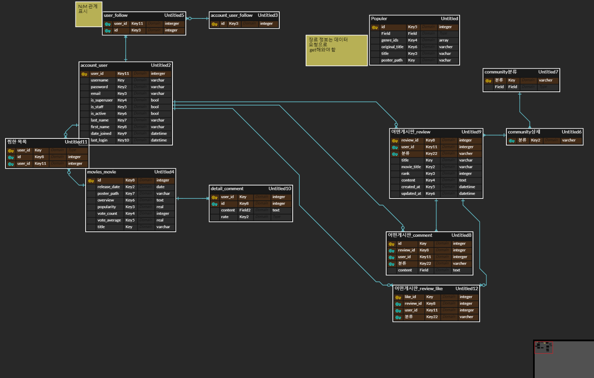

# 최종 프로젝트

[TOC]

### 1. 목표

- 영화 데이터 기반 추천 서비스 구성
- 영화 추천 알고리즘 구성
- 켜뮤니티 서비스 구성
- HTML, CSS, JavaScript, Vue.js, Django, REST API, Database 등을 활용한 실제 서비스 설계
- 서비스 관리 및 유지보수


### 2. 개발 환경

1. 언어
   - Python 3.8+
   - Django 3.2.12
   - Node LTS
   - Vue.js 2.+
2. 도구
   - Visual Studio Code
3. 아키텍처
   - Django REST API 서버 & Vue.js


### 3. 팀원 정보 및 업무 분담

##### ✨전지수

- FE, BE

##### ✨김지수

- FE, BE


### 4. 필수 요구사항

1. 영화 데이터 수집
   - TMDB 데이터 수집
2. 관리자 뷰
   - 관리자 권한의 유저만 영화 CRUD 권한을 가짐
3. 영화 정보
   - TMDB API를 이용해 직접 영화 데이터를 받아오는 VIEW 함수를 작성
4. 영화 추천 알고리즘
   - 유저가 평가 한 영화 기반 추천

5. 커뮤니티
   - 공지사항
   - 자유게시판, 영화 리뷰
   - 인기 장르별 게시판


### 5. 목표 서비스 구현 및 실제 구현 정도

✔소셜 로그인 => 실패

✔기념일 영화 추천 서비스 => 성공

✔검색 서비스 => 성공

✔유저의 평가를 통한 영화 추천 => 성공


### 6. 데이터베이스 모델링



##### :one: User

: account_user model은 django에서 제공하는 AbstractUser를 이용하여 모델을 만들었습니다.

 해당 모델은 django-restframework에서 제공하는 기능으로, 서버에 적절하게  필요한 정보를 제공해준다면, dj-rest-auth, dj-rest-auth.registration을 이용하여 db에 유저의 가입정보 및 로그인 key값을 저장해주어 유저의 정보를 관리할 수 있습니다. 

​	해당 모델에 

```
followings = models.ManyToManyField('self', symmetrical=False, related_name='followers')
```

 foloowing 을 ManyToManyField 를 self 참조로 추가하여, 사용자들 간에 프로필을 접근할 수 있도록 하였습니다. 


##### :two: Community, Article,  Comment

(1) Community

- Community model에 CharField로 Article에서 커뮤니티를 분류해서 글을 쓸 수 있도록 하였습니다.

- 단순히 게시판에 글을 최신순으로 나열하지 않고, 자유게시판, 공지사항, 공포, SF, 애니메이션 등 관심있는 주제의 글을 선택해서 볼 수 있게 모델링하였습니다.

  

(2) Article 

- 해당 모델에는 user, title, content, created_at, updated_at  외에 like_users와 community_id의 필드를 추가하였습니다. 

 - like_user의 경우 settings.AUTH_USER_MODEL 과 ManyToManyField를 설정하여 마음에 드는 Article에 좋아요를 누르고, 자신이 좋아하는 글을 모아볼 수 있도록 모델링하였습니다. Article의 detail페이지에서 현재 게시글의 좋아요 수를 확인할 수 있습니다. 유저는 여러 개의 글을 좋아요 누를 수 있고, 게시글 역시 게시글을 좋아하는 사용자를 여러명 가질 수 있기에 ManyToManyField가 적절하다고 판단하였습니다. 

 - community_id 필드를 Community 모델과 ForeignKey를 설정하여  한 개의 커뮤니티_id가 여러개의 Article을 가질 수 있도록 모델링하였습니다. 

   

(3) Comment

- 로그인 한 사용자는 Article의 detail페이지에서 해당 게시글에 댓슬을 달 수 있습니다.  article 한 개의 여러개의 댓글이 달릴 수 있기 때문에, Comment모델의 article 필드에 ForeignKey를 지정하였습니다. 


##### :three: Movie

##### Movie data 저장과 활용을 위한 모델

(1) Genre

 - 장르의 id 와 장르의  name을 정의해둔 모델 , tmdb에서 장르에 대한 데이터를 요청해 어떤 장르가 어떤 아이디 값을 가지는지 확인할 수 있습니다. 

   

(2) Actor

 - 배우의 정보를 정의해둔 모델 , tmdb에서 장르에 대한 데이터를 요청해 어떤 장르가 어떤 아이디 값을 가지는지 확인할 수 있습니다. 

   

(3) Movie

 - 해당 모델을 통해 영화의 detail 정보를 tmdb에서 받아올 수 있습니다. 또한 영화의 정보에 접근할 때 Movie 모델을 기준으로 다른 모델들과의 ManyToMany관계를 설정하고, serializer를 통해 서버에 JsonResponse하여 더 많은 정보를 프론트엔드에서 받아서 활용할 수 있도록 하였습니다. 

   

 - like_users 를 유저정보와 ManyToManyField 설정하여, 해당 영화를 좋아하는 사람이 몇명인지 확인할 수 있고, 또한 serializer를 통해 역참조를 한다면 해당 유저가 어떤 영화들을 좋아하는지 알 수 있습니다. 이 정보는 추후에 유저가 평가 한 영화 기반 추천 알고리즘을 구현할 때 좋아하는 영화의 정보를 기준으로 유사한 영화를 추천할 수 있도록 분석할 수 있는 기반이 됩니다. 


(4) MovieComment

 - 영화의 detail 페이지에서 영화에 대한 댓글을 달며 다른 사용자와 소통할 수 있도록 하였습니다. 

   

(5) Keyword

- keyword 모델을 통해 영화가 어떤 keyword를 가지는 지 확인할 수 있습니다. 이는 Movie 모델에서 ManyToManyField 로 참조하여 저장합니다. 해당 영화가 어떤 유형의 영화인지 유추할 수 있는 중요한 정보를 저장할 수 있는 모델입니다. 영화 간의 유사도를 검사할 때 어떤 keyword를 가지고 있는지 역시 추가적으로 고려할 수 있도록 모델에 추가하였습니다. 


(6) TodayRecommend 

- 사용자들에게 기념일 등 특별한 날에 관련있는 영화를 추천해주기 위한 월, 일 정보, 해당 날짜에 대한 간략한 정보를 저장할 수 있도록 모델을 설정하였습니다. 오늘의 영화를 추천해줄 때 오늘에 해당하는 정보를 기반으로 사용자들에게 유사한 영화를 추천해줄 수 있습니다. 

(7) Enmovie

- 기념일 관련 영화를 추천할 때 필요한 영화 정보를 overview만 담은 모델입니다. 간단하고 빠르게 정보를 얻기 위해 해당 정보는 간략하게 설정하였습니다. 영화의 실제 id값과 영어로 된 overview를 저장할 수 있습니다.


### 7. 필수 기능에 대한 설명!

#### (1) TMDB 데이터 수집

- TMDB API에서 API_KEY 를 발급받습니다. 영화를 가져오기 위해  popular 순으로 정렬된 곳에 requests를 보냈고, 데이터를 한 페이지 씩 가져와서 db에 저장해주었습니다.

  

- 우선 tmdb서버에 requests를 보내 장르에 대한 데이터를 가져와서 데이터 베이스에 저장하였습니다. 해당 정보는 장르의 id별로 지정된 장르의 name입니다. 

  

- youtube_key와 배우 이름, keyword 를 받아올 수 있는 함수를 미리 설정해둔 뒤 영화정보를 가져옵니다. movie_data 함수에서 popular 영화를 가져올 수 있는 url 을 통해 영화에 대한 정보를 tmdb에서 가져와 model에 해당하는 field값에 넣어주고 싶은 정보를 get해와서 creat()를 통해 데이터 베이스에 저장해줍니다. 

  

-  영화 정보를 저장한 뒤에 해당 영화의 genre_id 정보를 추가해주기 위해 영화에 genre id 값으로만 구성된 iterable한 정보를 for문을 통해 현재 영화의 genres 에 추가해 줍니다.

  

- 이를 가져올 수  keyword, actors 의 경우 tmdb에서 다시 정보를 가져와서 현재 영화에 해당하는 keyword 를 모두 저장, actors는 최대 5명의 정보만 받아 저장해 줍니다. 

  - 이를 통해 ManyToManyField, ForienKeyField에 해당하는 정보들을 연결하고  serializer를 통해 상호 정보를 참조, 역참조하여 json파일로 넘겨줄 수 있습니다. 

​	

#### (2) 커뮤니티  

- 커뮤니티 분류

  - 공지사항은 서버를 통해 작성할 수 있도록 vue에서는 접근을 막아주었습니다. 글을 작성할 때 어느 커뮤니티에 작성할 것인지를 선택한 뒤에 글을 작성한다. community id를 받아 Community 모델에 있는 name을 통해 관계를 설정할 수 있습니다. 
  - vue에서 Community에 들어가면 각 게시판 커뮤니티 별로 입장할 수 있는 버튼이 있으며, 그 버튼을 클릭하였을 때 해당되는 커뮤니티의 Article이 보여집니다. 
  - 분류로는 자유게시판, SF, 공포, 공지사항 등이 있습니다.

  

### 8. 영화 추천 알고리즘

#### :triangular_ruler: : 텍스트 정보 간의 코사인 유사도

##### 코사인 유사도 (Cosine Similarity)

- 코사인 유사도는 두 벡터 간의 코사인의 각도를 이용하여 구할 수 있는 두 벡터의 유사도를 의미합니다. 두 벡터의 방향이 100% 일치할 때에 1의 값을 가지며, 90도의 방향을 가지면 -1의 값을 가지게 됩니다. 코사인 유사도는 -1이상 1이하의 값을 가지며 값이 1에 가까울수록 유사도가 높다고 판단할 수 있습니다. 

- 단어 행렬을 통해 문서의 유사도를 구할 수 있으며 A 라는 문장 하나를 기준으로 다른 문장들과 비교하여 코사인 유사도를 구할 수 있습니다. 한 문장을 기준으로하였을 때 다른 한 문서 내의 모든 단어가 빈도수가 동일하게 증가할 경우에 동일한 기존의 문서와의 코사인 유사도는 높아질 수 있습니다. 코사인 유사도는 벡터의 방향에 초점을 두기 때문에 문서의 길이가 다른 상황에서 비교적으로 공정한 비교를 할 수 있도록 도와준다는 특징을 가지고 있습니다. 

  

#### :movie_camera: 유저가 좋아하는 영화 기반 영화 추천

- 영어로 된 텍스트 데이터를 유사도를 비교할 수 있게 끔 변형해줄 수 있는 자연어 처리 기능인 TfidfVectorizer 를 사용하였습니다. 

-  TfidfVectorizer 를 이해하기 위해서는 Tf와 Idf 의 기능을 이해해야 합니다.

  - ###### Tf (Term Frequency)

    - 하나의 문서에서 특정한 단어가 등장하는 횟수를 분석해주는 역할을 합니다.

  - ###### Idf(Inverse Document Frequency)

    - 특정 단어가 몇 개의 문장에 등장하는지를 수치화한 Df (Document Frequency)의 역수가 idf입니다.
    - 역수 개념을 사용하는 이유는, 짧은 문장에 여러 특정 단어가 등장할 수록 큰 숫자가 될 수 있도록 하며, 긴 문장에 특정 단어가 등장할 때는 숫자가 작아지게 함으로써 여러 문장에 의미 없이 사용되는 단어의 가중치를 줄이기 위해서입니다. 의미와 관련되지 않은 단어란 영어에서 is, are, were, dosen't 등의 동사를 의미하며, 이 방식을 사용하는 이유는 문장의 유사도와는 큰 관련이 없는 동사들을 유사도를 판단할 때 영향력을 줄이기 위함입니다.

    

- Tf-idf 수치는 Tf 값과 Idf 값을 곱하여 구할 수 있으며. 해당 연산을 거친  Tf-idf 값은 0과 1사이로 만들어집니다. 수치화된 값을 통해 유저가 좋아요를 누른 영화들을 분석하여 코사인의 유사도를 측정한 뒤 유저가 좋아하는 영화를 기준으로 cosign 유사도를  sorted를 통해 정렬하면 distance 가 가장 가까운 영화의 아이디를 구할 수 있습니다. 

  

- 추천의 유사도를 높이기 위해서 db에 저장한 영화의 정보를 합쳐서 하나의 문장으로 만들었습니다. 합친 field들은 overview, keyword, genre data입니다. 

  ```python
  def recommendedCsv(request):
      movies = Movie.objects.all()
      col = {'movie_id':[], 'title':[], 'tags':[]}
      movie_tags = pd.DataFrame(col)
      for movie in movies:
          tag = movie.overview
          tag += ' '
          keywords = movie.keywords.all()
          for k in keywords:
              tag += k.name
              tag += ' '
  
          genres = movie.genres.all()
          for g in genres:
              tag += g.name
              tag += ' '
          
          data = {'movie_id': int(movie.id), 'title': movie.title, 'tags':tag} 
          movie_tags = movie_tags.append(data, ignore_index=True)
      
      movie_tags.to_csv('movie_tags.csv', encoding='utf-8')
      return HttpResponse({'message':'성공'})
  ```

   : 데이터 베이스를 이용해 새로운 문장을 만들어 csv 파일로 만들기 위한 코드입니다.


- 유저가 좋아하는 영화 정보를 받으면 해당 csv 파일에 있는 영화의 경우 해당 영화와 그 외의 영화들을 비교하여 가장 유사도가 가까운 영화를 4개 씩 뽑아 return 해줄 수 있습니다.  return 된 영화의 아이디가 db에 있는 경우에 리스트에 넣어줍니다. 

  ```python
  def recommend(movie_id_list):
      movie_tags= pd.read_csv('./movies/movie_tags.csv', encoding='UTF-8')
      lv = TfidfVectorizer(max_features=5000, stop_words='english')
      vector = lv.fit_transform(movie_tags['tags']).toarray()
      similarity = cosine_similarity(vector)
      result = []
      for movie_id in movie_id_list:
          if not movie_tags[movie_tags['movie_id'] == movie_id].empty:
              index = movie_tags[movie_tags['movie_id'] == movie_id].index[0]
              distances = sorted(list(enumerate(similarity[index])), reverse=True, key=lambda x: x[1])
              for i in distances[1:5]:
                  result.append(movie_tags.iloc[i[0]].movie_id)
          else: continue
      return result
  
  
  import random
  @api_view(['GET'])
  def movie_recommend(request):
      user_like_movie = []
      movies = Movie.objects.filter(like_users=request.user.id)
      for movie in movies:
          user_like_movie.append(movie.id)
      movie_list = recommend(user_like_movie)
      if movie_list:
          movies = []
          for movie_id in movie_list:
              a = Movie.objects.filter(pk=int(movie_id))
              if a:
                  movies.append(Movie.objects.filter(pk=movie_id)[0])
          if not movies:
              return Response({'message': '당신이 좋아하는 영화에 대한 정보가 부족합니다.'})
          sample_list = random.sample(movies, 4)
          serializer = MovieListSerializer(sample_list, many=True)
          return Response(serializer.data, status=status.HTTP_200_OK)
  ```

  

#### :calendar: 오늘 해당하는 기념일 기반 영화 추천

: 오늘 날짜에 해당하는 기념일 기반 추천 영화를 해주고 싶었습니다. 마치 구글이 기념일 마다 글을 띄워줄 때  처럼 말입니다. 

- 문제점 봉착 : 기념일을 알려주는 한글, 영어를 모두 지원해주는 API가 없다는 것. 
- 문제점 해결 : 몇 개의 기념일 csv 파일을 수작업으로 작성해보자. 모든 것들 말고 몇개만!
- 문제점 봉착 2 : csv 파일 내에서의 유사도를 측정하는 것은 유저의 좋아요 영화 기반으로한 추천 알고리즘에서 성공했으나, 하나의 csv 파일 내의 1 개의 정보와 나머지 csv 파일 내의 영화 전부를 비교해주는 방법을 찾지 못했습니다. 
- 문제점 해결 : 기념일과 영화 정보들을 json파일로 변경해 db에 저장하여 오늘 날짜의 string을 직접 비교하자.


##### :star: 기념일 기반 영화 추천

`from datetime import datetime` 를 해와서 오늘에 해당하는 월과 일을 db에 저장된 기념일의 날짜와 같은 형식으로 맞추어 today 변수를 지정했습니다. 

데이터 베이스에 저장해둔 TodayRecommend 에 해당 날짜가 있는지 확인하고 overview 로 설명되어있는 영화 정보를 가져와 날짜의 overview와 영화의 overview를 비교하여 코사인 유사도를 구해, 파이썬의 sort함수를 통해 정렬해주었습니다.  

##### :star: 결과 코드

```python
from datetime import datetime
import math 
import re
from collections import Counter


def get_cosign(id, movie_overview, date_overview):
    intersection = set(movie_overview.keys())&set(date_overview.keys())
    numerator = sum([movie_overview[x]*date_overview[x] for x in intersection])
    sum1 = sum([movie_overview[x]**2 for x in list(movie_overview.keys())])
    sum2 = sum([date_overview[x]**2 for x in list(date_overview.keys())])
    denominator = math.sqrt(sum1)*math.sqrt(sum2)

    if not denominator:
        return 0.0
    else:
        return [id, float(numerator)/denominator]


@api_view(['GET'])
def today_recommend(request):
    WORD =re.compile(r"\w+")
    today = datetime.today().strftime("%m-%d")
    date = get_object_or_404(TodayRecommend, date=today)
    movies = Enmovie.objects.all()[1:700]
    result = []
    if date:
        word1 = WORD.findall(date.overview)
        date_overview = Counter(word1)
        for movie in movies:
            word2 = WORD.findall(movie.overview)
            movie_overview = Counter(word2)
            temp_result = get_cosign(movie.id, movie_overview, date_overview)
            result.append(temp_result)
        result.sort(key=lambda x:x[1])
    if result:
        movies = []
        for movie in result[0:12]:
            a = Movie.objects.filter(pk=movie[0])
            if a:
                movies.append(a)
        if not movies:
            return Response({'message': '오늘은 별 날이 아니군여...ㅎㅎ'})
        
        serializer = MovieListSerializer(movies, many=True)
        return Response(serializer.data, status=status.HTTP_200_OK)
        
    return Response({'message':'메롱'})
```


### 9. 느낀점

### 😄 전지수

: 이번 프로젝트를 통해 얻은 가장 큰 수확은 한 학기동안 공부했던 모든 것을 동원하여 결과물을 만들어냈다는 사실입니다. 처음 싸피에 입과했을 때 hello world를 프린트 할 줄도 몰랐던 제가 원하는 기능을 구현하고 스스로 공부하면서 프로젝트를 끝마쳤다는 점이 가장 기쁩니다.

프로젝트를 진행하면서, 처음 목표로 했던 모든 기능을 완벽하게 구현하지는 못했습니다. 소셜 로그인 기능을 넣어주기 위해 바쁜 일정 속에서 꼬박 하루를 투자하여 강의를 복습하고 자료를 찾아보며 코드를 작성했지만 결국 client 화면에서 데이터를 받아 server로 넘겨주지 못 한 채 마무리 했습니다. 그러나 이 과정에서 팀원 김지수님을 통해 server에서 데이터를 받아올 수 있다는 점을 알게 되었으며 프로젝트가 끝 난 뒤에 추가로 공부해보기로 하며 향후 저희 프로젝트를 발전시킬 계획을 수립했습니다.

소셜 로그인 기능 외에도 수차례의 실패를 거듭했지만 정종윤 교수님과 2반 교육생분들이 함께 고민하고 시도해보며 문제를 해결해나갈 수 있었습니다. 수업에서 배웠던 기능을 이용해 커뮤니티를 여러개 생성하여 각 커뮤니티 주제에 맞게 글을 쓸 수 있도록 하는 기능을 구현하고 싶었는데 마음처럼 되지 않아 긴 시간을 고민했습니다. 이 때에도 다른 교육생들과 소통하면서 기능을 구현하는 데 필요한 시도들을 해볼 수 있었고 결과적으로 여러개의 커뮤니티를 생성하는데 성공하면서 가장 큰 성취를 느꼈습니다. 프로젝트 기간 동안 도움을 받는 데 그치지 않고 제가 가진 지식을 나누기 위해 사람들과 소통하며 즐겁게 프로젝트를 진행하였습니다.

타인과 소통하며 프로젝트를 끌어나가는 것에 큰 부담감이 있었지만 항상 웃으면서 다가와 준 팀원 김지수 교육생 덕분에 프로젝트를 진행하는 열흘 내내 공부 외적으로도 정말 많이 배웠습니다. 앞으로 남은 2학기 프로젝트도 원활하게 진행할 수 있을 것 같다는 용기를 얻었습니다.

### :happy: 김지수

: 싸피 면접 때 부터 같이 준비했던 분과 같은 반이 되고 최종 프로젝트 팀까지 되어서 감회가 새로웠습니다.  둘 다 긍정적인 성격이었기 때문에, 막힐 때도 서로 도와가며 열심히 할 수 있었습니다. 

 처음에는 sirializer도, 데이터 베이스 조작도 모델 간의 관계도 공부는 했었지만, 직접 많은 양의 코드를 작성해 본 적은 없었기에 낯설고 헤매기도 했습니다. 처음 보는 오류 메세지도 많이 보았고, 정말 해결할 수 없을 것 같다고 생각한 문제로 새벽까지 고민하기도 했습니다. 혼자서 해결한 오류들도 있었고, 반 동기들에게 늦은 시간에 질문하며 서로 도와주기도 하며 프로젝트를 마무리할 수 있었습니다. 

 소셜로그인을 도전하다, 결국 django 에서 받고 회원가입을 해준 뒤에 vue에 어떻게 로그인을 했다는 것을 알려줄 지 해결하지 못해 시도에 그쳤습니다. 아쉬움이 있었으나, 그 과정에서 서버 간의 소통이 어떻게 일어나는지 더 많이 배울 수 있었습니다. 또한 로그인을 했다는 것을 vue에 넘겨주지 못했을 뿐, 서버에서는 로그인과 회원가입을 소셜로그인을 통해 했다는 것도 신기하기도 했습니다. 

 1주일 정도 주어진 기간 동안 싸피에서 배운 것들을 통해 웹을 만들어 나갈 수 있었다는 것이 재미있는 경험이었습니다. 이번에 배운 점을 토대로 방학 기간 동안 추가로 하고싶은 기능을 더해보고 싶기도 했으며, 데이터 베이스를 조작하는 것이 재미있다는 것을 느낄 수 있었습니다. 현재 백엔드 스터디를 진행하고 있기는 하지만, 추가로 쿼리셋, SQLite, modeling, serialize를 공식문서를 보며 공부해야겠다는 다짐을 하였습니다.

전지수님과 함께해서 아주아주 즐거웠습니다.


### 10. 일자별 진행 사항

##### 🚶‍♀️0516

공동작업

- [x] 프로젝트 구상

##### 🚶‍♀️0517

공동작업

- [x] 데이터베이스 모델링
- [x] Django 프로젝트 생성
- [x] Django accounts/articles/movies 앱 설계

##### 🚶‍♀️0518

공동작업

- [x] Vue 회원가입/로그인/로그아웃 기능 구현
- [x] Django 모델 설계
- [x] Django serializers 생성
- [x] Django urls, views 생성

##### 🚶‍♀️0519

전지수

- [x] TMDB 데이터 가져오기
- [x] article C, R, D

김지수

- [x] Vue 메인 페이지 렌더링
- [x] comment Create

##### 🚶‍♀️0520

전지수

- [x] Movie detail 화면 Read
- [x] profile 화면 Read
- [x] Community 개설
- [x] Community url 연결, views 작성

김지수

- [x] Movie Detail Youtube Api로 동영상 불러오기
- [x] Movie poster Read
- [x] Article Update
- [x] Article comment R, U, D


##### 🚶‍♀️0521

전지수

- [x] 유저 팔로우 / 팔로잉 구현
- [x] 프로필 페이지 렌더링
- [x] Community 정보 불러오기

김지수

- [x] home 페이지 새로 만들기!! get populer 가져와서 배열하기
- [x] articles => home변경
- [x] moviedetail 페이지에 뭐 보여줄지 Genre, Actors => serializer 배치하기
- [x] movie detail 페이지에서 comment C, R, U, D

##### 🚶‍♀️0522

전지수

- [x] Community에 Article 보여주기

김지수

- [x] 찜한 목록들 모아주기 -> 새로 페이지 만들기, 목록 나눠 넣기 (x)
- [x] 네브바 꾸미기 로고
- [x] 검색 바 만들고 링크 걸어주기 -> 검색 list 페이지로 , views랑 url도 대충 만들어놓기

##### 🚶‍♀️0523

전지수

- [x] Articles article 상세보기
- [x] comment
- [x] 로그인 페이지에 사인업으로 가는 버튼 넣어주고 로그인, 사인업 꾸미기
- [x] 글쓰기 버튼 수정
- [x] community 카테고리 nav bar 만들기

김지수

- [x] Movie detail
- [x] movies 추천페이지
- [x] search bar 검색 기능 넣기
- [x] float 버튼 만들기
- [x] profile 페이지

##### 🚶‍♀️0524

전지수

- [x] 팔로우/언팔로우, 좋아요/좋아요 취소 버튼 나눠주기

김지수

- [x] 팔로우 한 사람들 보여주기
- [x] movies.json => movies_csv

##### 🚶‍♀️0525

전지수

- [ ] social login

김지수

- [x] 형태소 분석 알고리즘으로 검색 기능 강화
- [x] 형태소 분석 알고리즘으로 영화 추천 기능 구현

공동작업

- [x] date 알고리즘 관련 model, data 구현

##### 🚶‍♀️0526

- [x] model > enmovie migrate
- [x] enmovie loaddata > date 비교하는 코드
- [x] 추가 웹꾸미기
- [x] 발표 자료 만들기
- [x] Vue 날짜별 추천 movie 보여주기
- [x] README.md 작성
